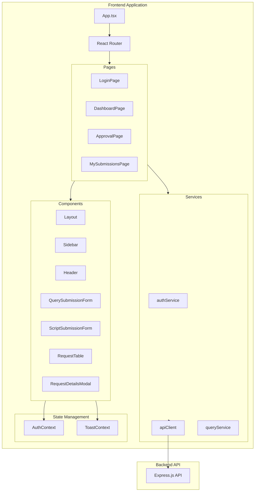

# Design Document: React Frontend for Database Query Portal

## Overview

This document describes the technical design for a React frontend application that integrates with the existing Database Query Execution Portal backend. The frontend will be built using React 18 with Vite as the build tool, Tailwind CSS for styling, and React Router for navigation. The application will be created in a separate `frontend` directory to avoid conflicts with the existing backend.

## UI Design System

### Color Palette
```css
/* Primary Colors - Professional Blue Theme */
--primary-50: #eff6ff;
--primary-100: #dbeafe;
--primary-500: #3b82f6;
--primary-600: #2563eb;
--primary-700: #1d4ed8;

/* Neutral Colors */
--gray-50: #f9fafb;
--gray-100: #f3f4f6;
--gray-200: #e5e7eb;
--gray-300: #d1d5db;
--gray-500: #6b7280;
--gray-700: #374151;
--gray-800: #1f2937;
--gray-900: #111827;

/* Status Colors */
--success: #10b981;  /* Green - Executed */
--warning: #f59e0b;  /* Amber - Pending */
--error: #ef4444;    /* Red - Rejected/Failed */
--info: #3b82f6;     /* Blue - Info */

/* Background */
--bg-sidebar: #1f2937;  /* Dark gray sidebar */
--bg-main: #f9fafb;     /* Light gray main content */
--bg-card: #ffffff;     /* White cards */
```

### Typography
```css
/* Font Family */
font-family: 'Inter', -apple-system, BlinkMacSystemFont, 'Segoe UI', sans-serif;

/* Font Sizes */
--text-xs: 0.75rem;    /* 12px */
--text-sm: 0.875rem;   /* 14px */
--text-base: 1rem;     /* 16px */
--text-lg: 1.125rem;   /* 18px */
--text-xl: 1.25rem;    /* 20px */
--text-2xl: 1.5rem;    /* 24px */
```

### Component Styling

#### Sidebar
- Dark background (#1f2937)
- White text for navigation items
- Blue highlight for active item
- Logo at top
- Width: 256px (desktop), collapsible on mobile

#### Header
- White background with bottom border
- User email on right
- Logout button
- Height: 64px

#### Cards/Forms
- White background
- Rounded corners (8px)
- Subtle shadow
- Padding: 24px

#### Buttons
- Primary: Blue (#3b82f6) with white text
- Secondary: White with gray border
- Danger: Red (#ef4444) for reject actions
- Rounded corners (6px)
- Padding: 8px 16px

#### Tables
- White background
- Gray header row
- Hover state on rows
- Alternating row colors (optional)

#### Status Badges
- Executed: Green background, white text
- Pending: Amber background, dark text
- Rejected: Red background, white text
- Failed: Red outline, red text

## Architecture



## Components and Interfaces

### Core Services

#### API Client (`src/services/apiClient.ts`)
```typescript
interface ApiClientConfig {
  baseURL: string;
  timeout: number;
}

interface ApiResponse<T> {
  success: boolean;
  data?: T;
  message?: string;
  error?: {
    code: string;
    message: string;
  };
}

// Axios instance with interceptors for:
// - Adding Authorization header
// - Automatic token refresh on 401
// - Error transformation
```

#### Auth Service (`src/services/authService.ts`)
```typescript
interface LoginCredentials {
  email: string;
  password: string;
}

interface AuthTokens {
  accessToken: string;
  refreshToken: string;
  expiresIn: number;
}

interface User {
  id: string;
  email: string;
  name: string;
  role: 'developer' | 'manager' | 'admin';
  podId?: string;
  slackUserId?: string;
}

interface AuthService {
  login(credentials: LoginCredentials): Promise<{ user: User; tokens: AuthTokens }>;
  logout(): Promise<void>;
  refreshToken(): Promise<AuthTokens>;
  getStoredUser(): User | null;
  getAccessToken(): string | null;
}
```

#### Query Service (`src/services/queryService.ts`)
```typescript
interface Instance {
  id: string;
  name: string;
  type: 'postgresql' | 'mongodb';
}

interface Database {
  name: string;
}

interface Pod {
  id: string;
  name: string;
  managerEmail: string;
}

interface QueryRequest {
  id: number;
  uuid: string;
  userId: string;
  databaseType: string;
  instanceId: string;
  instanceName: string;
  databaseName: string;
  submissionType: 'query' | 'script';
  queryContent?: string;
  scriptFilename?: string;
  comments: string;
  podId: string;
  podName: string;
  status: 'pending' | 'approved' | 'rejected' | 'executing' | 'completed' | 'failed';
  executionResult?: string;
  errorMessage?: string;
  createdAt: string;
  approvedAt?: string;
  approverEmail?: string;
}

interface SubmitQueryPayload {
  instanceId: string;
  databaseName: string;
  submissionType: 'query' | 'script';
  queryContent?: string;
  comments: string;
  podId: string;
}

interface QueryService {
  getInstances(type?: string): Promise<Instance[]>;
  getDatabases(instanceId: string): Promise<Database[]>;
  getPods(): Promise<Pod[]>;
  submitQuery(payload: SubmitQueryPayload): Promise<QueryRequest>;
  submitScript(formData: FormData): Promise<QueryRequest>;
  getMyRequests(params?: PaginationParams): Promise<PaginatedResponse<QueryRequest>>;
  getPendingRequests(params?: FilterParams): Promise<PaginatedResponse<QueryRequest>>;
  getRequest(uuid: string): Promise<QueryRequest>;
  approveRequest(uuid: string): Promise<QueryRequest>;
  rejectRequest(uuid: string, reason?: string): Promise<QueryRequest>;
  cloneRequest(uuid: string): Promise<QueryRequest>;
}
```

### React Components

#### Layout Component
```typescript
interface LayoutProps {
  children: React.ReactNode;
}
// Renders Header, Sidebar, and main content area
// Handles responsive sidebar collapse on mobile
```

#### Sidebar Component
```typescript
interface NavItem {
  label: string;
  path: string;
  icon: React.ComponentType;
  roles: ('developer' | 'manager' | 'admin')[];
}
// Renders navigation based on user role
// Highlights active route
```

#### QuerySubmissionForm Component
```typescript
interface QuerySubmissionFormProps {
  onSuccess?: () => void;
}
// Handles cascading dropdowns
// Validates form fields
// Submits to API
```

#### RequestTable Component
```typescript
interface RequestTableProps {
  requests: QueryRequest[];
  loading: boolean;
  onApprove?: (uuid: string) => void;
  onReject?: (uuid: string) => void;
  onView: (uuid: string) => void;
  onClone?: (uuid: string) => void;
  showActions: ('approve' | 'reject' | 'view' | 'clone')[];
}
// Renders table with pagination
// Handles action callbacks
```

#### RequestDetailsModal Component
```typescript
interface RequestDetailsModalProps {
  request: QueryRequest | null;
  isOpen: boolean;
  onClose: () => void;
}
// Displays full request details
// Shows execution results or errors
// Provides copy-to-clipboard for query
```

### Context Providers

#### AuthContext
```typescript
interface AuthContextValue {
  user: User | null;
  isAuthenticated: boolean;
  isLoading: boolean;
  login: (credentials: LoginCredentials) => Promise<void>;
  logout: () => Promise<void>;
}
```

#### ToastContext
```typescript
interface Toast {
  id: string;
  type: 'success' | 'error' | 'info' | 'warning';
  message: string;
  duration?: number;
}

interface ToastContextValue {
  toasts: Toast[];
  addToast: (toast: Omit<Toast, 'id'>) => void;
  removeToast: (id: string) => void;
}
```

## Data Models

### Frontend State Models

```typescript
// Form state for query submission
interface QueryFormState {
  databaseType: string;
  instanceId: string;
  databaseName: string;
  submissionType: 'query' | 'script';
  queryContent: string;
  scriptFile: File | null;
  comments: string;
  podId: string;
}

// Filter state for approval dashboard
interface ApprovalFilters {
  podId?: string;
  status?: string;
  search?: string;
  startDate?: string;
  endDate?: string;
}

// Pagination state
interface PaginationState {
  page: number;
  limit: number;
  total: number;
}
```

## Correctness Properties

*A property is a characteristic or behavior that should hold true across all valid executions of a system-essentially, a formal statement about what the system should do. Properties serve as the bridge between human-readable specifications and machine-verifiable correctness guarantees.*

### Property 1: Unauthenticated Access Protection
*For any* route that requires authentication, if a user is not authenticated, the Portal should redirect to the Login page.
**Validates: Requirements 1.1, 1.6**

### Property 2: Token Storage and Retrieval
*For any* successful login, the JWT tokens should be stored and retrievable for subsequent API requests.
**Validates: Requirements 1.2**

### Property 3: Invalid Credentials Error Handling
*For any* login attempt with invalid credentials, the Portal should display an error message that does not expose sensitive details.
**Validates: Requirements 1.3**

### Property 4: Logout Clears Credentials
*For any* logout action, all stored tokens and user data should be cleared from storage.
**Validates: Requirements 1.4, 10.5**

### Property 5: Role-Based Navigation
*For any* authenticated user, the sidebar navigation should display only links appropriate for their role.
**Validates: Requirements 2.1, 2.2, 2.3, 2.4**

### Property 6: Cascading Dropdown Filtering
*For any* database type selection, the instance dropdown should contain only instances of that type, and for any instance selection, the database dropdown should contain only databases from that instance.
**Validates: Requirements 3.1, 3.2**

### Property 7: Form Validation
*For any* form submission attempt, if required fields are empty or invalid, the Portal should display specific error messages for each invalid field.
**Validates: Requirements 3.7, 3.8**

### Property 8: Script File Validation
*For any* file upload in script submission, only .js files should be accepted; non-.js files should be rejected with an error message.
**Validates: Requirements 4.4, 4.5**

### Property 9: POD-Based Request Filtering
*For any* manager viewing the Approval Dashboard, only requests for their assigned PODs should be visible; for admins, all POD requests should be visible.
**Validates: Requirements 5.1, 5.2**

### Property 10: Approval Action API Call
*For any* approve action, the Portal should send a POST request to the approval endpoint with the correct request UUID.
**Validates: Requirements 5.4**

### Property 11: Rejection with Reason
*For any* rejection with a provided reason, the rejection request should include the reason in the payload.
**Validates: Requirements 5.6**

### Property 12: Clone Creates New Submission
*For any* clone action on a request, a new submission should be created with the same data as the original.
**Validates: Requirements 6.4**

### Property 13: Status Visual Indicators
*For any* request displayed in a table, the status should be rendered with the correct visual indicator based on its value.
**Validates: Requirements 6.5**

### Property 14: Loading State Display
*For any* API request in progress, a loading indicator should be displayed and submit buttons should be disabled.
**Validates: Requirements 8.1, 8.3**

### Property 15: Toast Notifications
*For any* API operation completion, a toast notification should be displayed indicating success or failure.
**Validates: Requirements 8.4, 8.5**

### Property 16: URL Parameter Security
*For any* navigation or API call, sensitive data (tokens, passwords) should not be exposed in URL parameters.
**Validates: Requirements 10.2**

## Error Handling

### API Error Handling
```typescript
// Error types from backend
interface ApiError {
  code: string;
  message: string;
  details?: unknown;
}

// Error handling strategy
const handleApiError = (error: ApiError): string => {
  switch (error.code) {
    case 'INVALID_CREDENTIALS':
      return 'Invalid email or password';
    case 'ACCOUNT_DEACTIVATED':
      return 'Your account has been deactivated';
    case 'RATE_LIMIT_EXCEEDED':
      return 'Too many requests. Please try again later';
    case 'VALIDATION_ERROR':
      return error.message || 'Please check your input';
    case 'NOT_FOUND':
      return 'The requested resource was not found';
    case 'FORBIDDEN':
      return 'You do not have permission to perform this action';
    default:
      return 'An unexpected error occurred';
  }
};
```

### Form Validation Errors
```typescript
interface ValidationErrors {
  [fieldName: string]: string;
}

// Validation rules
const validateQueryForm = (form: QueryFormState): ValidationErrors => {
  const errors: ValidationErrors = {};
  
  if (!form.databaseType) errors.databaseType = 'Database type is required';
  if (!form.instanceId) errors.instanceId = 'Instance is required';
  if (!form.databaseName) errors.databaseName = 'Database is required';
  if (!form.submissionType) errors.submissionType = 'Submission type is required';
  if (form.submissionType === 'query' && !form.queryContent?.trim()) {
    errors.queryContent = 'Query content is required';
  }
  if (form.submissionType === 'script' && !form.scriptFile) {
    errors.scriptFile = 'Script file is required';
  }
  if (!form.comments?.trim()) errors.comments = 'Comments are required';
  if (!form.podId) errors.podId = 'POD is required';
  
  return errors;
};
```

## Testing Strategy

### Unit Tests
Unit tests will verify specific component behaviors and edge cases using React Testing Library and Jest.

**Components to test:**
- LoginForm: credential validation, error display
- QuerySubmissionForm: field validation, cascading dropdowns
- RequestTable: rendering, action callbacks
- Sidebar: role-based navigation rendering
- StatusBadge: correct indicator for each status

### Property-Based Tests
Property-based tests will use fast-check to verify universal properties across many generated inputs.

**Configuration:**
- Minimum 100 iterations per property test
- Each test tagged with: **Feature: react-frontend, Property {number}: {property_text}**

**Properties to test:**
1. Route protection (Property 1)
2. Token storage/retrieval (Property 2)
3. Role-based navigation (Property 5)
4. Cascading dropdown filtering (Property 6)
5. Form validation (Property 7)
6. File type validation (Property 8)
7. Status indicator rendering (Property 13)

### Integration Tests
Integration tests will verify end-to-end flows using MSW (Mock Service Worker) for API mocking.

**Flows to test:**
- Login → Dashboard navigation
- Query submission → Success notification
- Approval flow → Status update
- Rejection flow → Reason submission
