# Database Query Execution Portal - Backend Documentation

> **For Notion:** Copy each mermaid code block and paste into a Notion "Code" block, then select "Mermaid" as the language.

---

# 1. Problem Statement & Solution

## The Problem

Developers need a controlled, auditable way to run ad-hoc queries and scripts against production databases (PostgreSQL, MongoDB) without direct database access.

### Current Process Gaps


### Project Goals


---

## My Solution

### Tech Stack Overview

```mermaid
block-beta
  columns 3
  
  block:backend["⚙️ Backend"]:3
    Node["Node.js"] Express["Express.js"] JWT["JWT Auth"]
  end
  
  block:database["🗄️ Databases"]:3
    Portal["PostgreSQL\n(Portal DB)"] Target1["PostgreSQL\n(Target)"] Target2["MongoDB\n(Target)"]
  end
  
  block:external["🌐 External"]:3
    Slack["Slack API"] AWS["AWS Secrets"] Jest["Jest Testing"]
  end
```

### User Roles & Permissions

```mermaid
graph TB
    subgraph Roles["👥 User Roles"]
        direction TB
        Dev["🧑‍💻 Developer"]
        Mgr["👔 Manager"]
        Admin["🔑 Admin"]
    end
    
    subgraph DevCan["Developer Can"]
        D1["✅ Submit queries/scripts"]
        D2["✅ View own requests"]
        D3["✅ Clone own requests"]
        D4["❌ Cannot approve"]
    end
    
    subgraph MgrCan["Manager Can"]
        M1["✅ All Developer actions"]
        M2["✅ View POD requests"]
        M3["✅ Approve/Reject POD requests"]
    end
    
    subgraph AdminCan["Admin Can"]
        A1["✅ All Manager actions"]
        A2["✅ View ALL requests"]
        A3["✅ Manage instances"]
        A4["✅ View statistics"]
    end
    
    Dev --> DevCan
    Mgr --> MgrCan
    Admin --> AdminCan
```

---

# 2. High-Level Architecture


---

# 3. Request Flow Architecture

## Complete Request Lifecycle

```mermaid
flowchart LR
    subgraph Submit["📝 Submit"]
        A["Developer\nSubmits"] --> B["Validate\nInput"]
        B --> C["Store\nRequest"]
    end
    
    subgraph Notify["📢 Notify"]
        C --> D["Status:\nPENDING"]
        D --> E["Slack\nChannel"]
    end
    
    subgraph Review["👀 Review"]
        E --> F{"Manager\nDecision"}
    end
    
    subgraph Execute["⚡ Execute"]
        F -->|"✅ Approve"| G["Run\nQuery"]
        G --> H{"Result?"}
    end
    
    subgraph Complete["✔️ Complete"]
        F -->|"❌ Reject"| I["DM:\nReason"]
        H -->|"Success"| J["DM:\nResults"]
        H -->|"Error"| K["DM:\nError"]
    end

    style Submit fill:#e1f5fe
    style Notify fill:#fff3e0
    style Review fill:#f3e5f5
    style Execute fill:#e8f5e9
    style Complete fill:#fce4ec
```

## Request State Machine

```mermaid
stateDiagram-v2
    [*] --> PENDING: 📝 Developer submits request
    
    PENDING --> APPROVED: ✅ Manager approves
    PENDING --> REJECTED: ❌ Manager rejects
    
    APPROVED --> EXECUTING: ⚡ Auto-execution starts
    
    EXECUTING --> COMPLETED: ✔️ Success (result.success=true)
    EXECUTING --> FAILED: 💥 Error (result.success=false)
    
    REJECTED --> [*]: 📱 DM sent with reason
    COMPLETED --> [*]: 📱 DM sent with results
    FAILED --> [*]: 📱 DM sent with error details
    
    note right of PENDING
        Slack notification sent
        to approval channel
    end note
    
    note right of EXECUTING
        Running in isolated
        Worker Thread sandbox
    end note
    
    note right of COMPLETED
        Results stored in
        execution_result column
    end note
```

---

# 4. Submission Flow

```mermaid
sequenceDiagram
    autonumber
    participant Dev as 🧑‍💻 Developer
    participant API as ⚙️ API Server
    participant Val as 🔍 Validator
    participant DB as 🗄️ Portal DB
    participant Slack as 📱 Slack

    Dev->>API: POST /api/requests
    API->>Val: Validate request body
    
    Val->>Val: Check instance exists
    Val->>Val: Check database exists
    Val->>Val: Check POD valid
    Val->>Val: Validate query/script
    
    alt Validation Failed
        Val-->>Dev: 400 Bad Request
    else Validation Passed
        Val->>DB: INSERT query_requests
        DB-->>Val: Request created (PENDING)
        Val->>Slack: Notify approval channel
        Slack-->>Val: Message sent
        Val-->>Dev: 201 Created {uuid, status}
    end
```

---

# 5. Approval & Execution Flow

```mermaid
sequenceDiagram
    autonumber
    participant Slack as 📱 Slack
    participant Mgr as 👔 Manager
    participant API as ⚙️ API Server
    participant DB as 🗄️ Portal DB
    participant Exec as 🔧 Executor
    participant Target as 🎯 Target DB

    Slack->>Mgr: 🔔 New request notification
    Mgr->>API: GET /api/requests/pending
    API-->>Mgr: List of pending requests
    
    Mgr->>API: Review request details
    
    alt ✅ Approve
        Mgr->>API: POST /api/requests/:uuid/approve
        API->>DB: Status → APPROVED
        API->>DB: Status → EXECUTING
        
        API->>Exec: Execute query/script
        Exec->>Target: Run against target DB
        Target-->>Exec: Results or Error
        
        alt Success
            Exec-->>API: {success: true, data}
            API->>DB: Status → COMPLETED
            API->>Slack: 📱 DM developer (results)
        else Failure
            Exec-->>API: {success: false, error}
            API->>DB: Status → FAILED
            API->>Slack: 📱 DM developer (error)
        end
        
    else ❌ Reject
        Mgr->>API: POST /api/requests/:uuid/reject
        API->>DB: Status → REJECTED
        API->>Slack: 📱 DM developer (reason)
    end
```

---

# 6. What Makes My Code Different

## Child Process + Worker Threads Architecture


## Clean Architecture Pattern

```mermaid
flowchart TD
    subgraph Routes["📍 Routes Layer"]
        R1["Define API endpoints"]
        R2["Validate request format"]
        R3["Apply middleware"]
    end
    
    subgraph Controllers["🎮 Controllers Layer"]
        C1["Handle HTTP request/response"]
        C2["Extract parameters"]
        C3["Call services"]
        C4["Format response"]
    end
    
    subgraph Services["⚙️ Services Layer"]
        S1["Business logic"]
        S2["Database operations"]
        S3["External API calls"]
        S4["Data transformation"]
    end
    
    subgraph Models["📊 Models Layer"]
        M1["Database queries"]
        M2["Data validation"]
        M3["Schema definitions"]
    end
    
    Routes --> Controllers --> Services --> Models
    
    style Routes fill:#ffebee
    style Controllers fill:#e3f2fd
    style Services fill:#e8f5e9
    style Models fill:#fff3e0
```

---

# 7. Security Pipeline


## Security Measures Implemented

```mermaid
mindmap
  root((🔐 Security))
    Authentication
      JWT Access Tokens
      Refresh Token Rotation
      Token Blacklisting
      Session Management
    Authorization
      Role-Based Access
      POD-Based Permissions
      Resource Ownership
    Input Protection
      Request Validation
      SQL Injection Prevention
      XSS Protection
    Infrastructure
      Helmet Security Headers
      CORS Configuration
      Rate Limiting
      No Hardcoded Credentials
```

---

# 8. Authentication Flow

```mermaid
sequenceDiagram
    autonumber
    participant User as 👤 User
    participant API as ⚙️ Auth API
    participant DB as 🗄️ Portal DB

    rect rgb(232, 245, 233)
        Note over User,DB: 🔐 Login Flow
        User->>API: POST /login {email, password}
        API->>DB: Find user by email
        DB-->>API: User record
        API->>API: Verify password (bcrypt)
        API->>API: Generate access token (15min)
        API->>API: Generate refresh token (7days)
        API->>DB: Store refresh token hash
        API-->>User: {accessToken, refreshToken, user}
    end

    rect rgb(227, 242, 253)
        Note over User,DB: 🔄 Token Refresh Flow
        User->>API: POST /refresh {refreshToken}
        API->>DB: Validate refresh token hash
        API->>DB: Check user_token_invalidation
        API->>API: Generate new access token
        API-->>User: {accessToken}
    end

    rect rgb(255, 243, 224)
        Note over User,DB: 🚪 Logout Flow
        User->>API: POST /logout
        API->>DB: Add access token to blacklist
        API->>DB: Revoke refresh token
        API-->>User: {success: true}
    end
```

---

# 9. Script Execution Sandbox

```mermaid
flowchart TD
    A["📄 Script Content"] --> B["🔧 Create Worker Thread"]
    
    subgraph Sandbox["🔒 Sandboxed Environment"]
        B --> C["Setup Isolated VM Context"]
        C --> D["💉 Inject db Object"]
        D --> E["📝 Inject console.log Capture"]
        E --> F["⏱️ Set 30s Timeout"]
        F --> G["▶️ Execute Script"]
    end
    
    G --> H{"Execution Result?"}
    
    H -->|"✅ Success"| I["📊 Capture Output & Data"]
    H -->|"❌ Script Error"| J["🐛 Capture Error + Line #"]
    H -->|"💾 DB Error"| K["🔴 Capture DB Error"]
    H -->|"⏰ Timeout"| L["💀 Kill Worker"]
    
    I --> M["📦 Format as JSON"]
    J --> M
    K --> M
    L --> M
    
    M --> N["💾 Store in query_requests"]
    N --> O["📱 Send Slack Notification"]

    style Sandbox fill:#fff8e1
    style I fill:#c8e6c9
    style J fill:#ffcdd2
    style K fill:#ffcdd2
    style L fill:#ffcdd2
```

---

# 10. Database Connection Management

```mermaid
flowchart LR
    subgraph Backend["⚙️ Backend Server"]
        A["🔧 Executor Service"]
        B["📋 Config Loader"]
        C["🔌 Connection Factory"]
    end

    subgraph Secrets["🔐 AWS Secrets Manager"]
        D["🔑 DB Credentials"]
    end

    subgraph Targets["🎯 Target Databases"]
        E[("PostgreSQL\nInstances")]
        F[("MongoDB\nInstances")]
    end

    A -->|"1️⃣ Get config"| B
    B -->|"2️⃣ Fetch creds"| D
    D -->|"3️⃣ Return secrets"| B
    B -->|"4️⃣ Create conn"| C
    
    C -->|"5️⃣ pg.Pool"| E
    C -->|"5️⃣ MongoClient"| F
    
    E -->|"6️⃣ Results"| C
    F -->|"6️⃣ Results"| C
    C -->|"7️⃣ Return"| A

    style Backend fill:#e3f2fd
    style Secrets fill:#fff3e0
    style Targets fill:#e8f5e9
```

---

# 11. Slack Notification Service

```mermaid
flowchart TD
    A["🎯 Event Triggered"] --> B{"Event Type?"}
    
    B -->|"📝 New Submission"| C["notifyNewSubmission()"]
    B -->|"✅ Approved + Success"| D["notifyApprovalSuccess()"]
    B -->|"❌ Approved + Failed"| E["notifyApprovalFailure()"]
    B -->|"🚫 Rejected"| F["notifyRejection()"]
    
    C --> G["📢 Post to POD Channel"]
    
    D --> H["📊 Format Success Message\n(Row counts + Preview)"]
    E --> I["🔴 Format Error Message\n(Type + Line + Reason)"]
    F --> J["📝 Format Rejection\n(Reason only)"]
    
    H --> K{"Get Slack User ID?"}
    I --> K
    J --> K
    
    K -->|"Has ID"| L["Use stored slack_user_id"]
    K -->|"No ID"| M["Lookup by email"]
    
    L --> N["📱 Send DM to Developer"]
    M --> N
    
    N --> O["📋 Log notification sent"]

    style C fill:#e3f2fd
    style D fill:#c8e6c9
    style E fill:#ffcdd2
    style F fill:#fff3e0
```

---

# 12. Testing Coverage

## 100% Branch Coverage Achieved


## Test Categories & Stack

```mermaid
flowchart TB
    subgraph Stack["🧪 Testing Stack"]
        Jest["Jest\nTest Runner"]
        Super["Supertest\nHTTP Testing"]
        Mocks["Mock Implementations\nDB & Slack"]
    end
    
    subgraph Categories["📋 Test Categories"]
        Auth["🔐 Auth Controller\n• Login/Logout\n• Token refresh\n• Validation"]
        Query["📝 Query Controller\n• Submit requests\n• List/Filter\n• Approve/Reject"]
        Exec["⚡ Execution Service\n• PostgreSQL\n• MongoDB\n• Script execution"]
        Mid["🛡️ Middleware\n• Auth middleware\n• Role verification\n• Input validation"]
    end
    
    Jest --> Super --> Mocks
    Mocks --> Auth & Query & Exec & Mid

    style Stack fill:#e3f2fd
    style Auth fill:#c8e6c9
    style Query fill:#fff3e0
    style Exec fill:#f3e5f5
    style Mid fill:#ffcdd2
```

---

# 13. Code Structure


---

# 14. AI Adoption & Learnings

## Where AI Helped

```mermaid
mindmap
  root((🤖 AI Assisted))
    Architecture
      System design planning
      Database schema design
      API endpoint structure
    Code Generation
      Boilerplate code
      CRUD operations
      Middleware templates
    Testing
      Jest test templates
      Mock implementations
      Edge case coverage
    Documentation
      Code comments
      API documentation
      Workflow diagrams
    Debugging
      Error analysis
      Performance tips
      Best practices
```

## Concrete AI Usage Examples

```mermaid
flowchart LR
    subgraph Examples["📝 Concrete Examples"]
        E1["🔐 JWT auth middleware\nstructure & flow"]
        E2["🧪 Jest test templates\nwith proper mocks"]
        E3["🗄️ Database schema\nrelationships"]
        E4["📱 Slack message\nblock formatting"]
        E5["✅ Input validation\nschemas (Joi)"]
    end

    style Examples fill:#e8f5e9
```

## My Development Approach

```mermaid
flowchart LR
    A["📋 Understand\nPRD Requirements"] --> B["🤖 Use AI for\nInitial Structure"]
    B --> C["👀 Review &\nCustomize Code"]
    C --> D["🧪 Test Thoroughly\n& Iterate"]
    D --> E["✅ Achieve\n100% Coverage"]
    
    style A fill:#ffcdd2
    style B fill:#f8bbd9
    style C fill:#e1bee7
    style D fill:#c5cae9
    style E fill:#c8e6c9
```

## Key Learnings

```mermaid
flowchart TD
    subgraph Learnings["💡 Key Learnings"]
        L1["🚀 AI accelerates development\nbut requires understanding"]
        L2["✅ Always validate\ngenerated code"]
        L3["📚 Best for learning\npatterns and syntax"]
        L4["🔍 Debugging requires\ndeep understanding"]
    end

    style Learnings fill:#fff3e0
```

---

# 15. Database Schema (Portal DB)

## Entity Relationship Diagram

```mermaid
erDiagram
    users ||--o{ query_requests : "submits"
    users ||--o{ query_requests : "approves"
    users ||--o{ refresh_tokens : "has"
    users ||--o{ access_token_blacklist : "has"
    users ||--|| user_token_invalidation : "has"
    users ||--o{ audit_logs : "creates"
    database_instances ||--o{ databases : "contains"
    query_requests ||--o{ slack_notifications : "triggers"

    users {
        uuid id PK
        varchar email UK
        varchar password_hash
        varchar name
        varchar role "developer|manager|admin"
        varchar pod_id
        varchar slack_user_id
        boolean is_active
        timestamp last_login
        timestamp created_at
        timestamp updated_at
    }

    query_requests {
        serial id PK
        uuid uuid UK
        uuid user_id FK
        varchar database_type "postgresql|mongodb"
        varchar instance_id
        varchar instance_name
        varchar database_name
        varchar submission_type "query|script"
        text query_content
        varchar script_filename
        text script_content
        text comments
        varchar pod_id
        varchar pod_name
        varchar status "pending|approved|rejected|executing|completed|failed"
        uuid approver_id FK
        varchar approver_email
        timestamp approved_at
        text rejection_reason
        text execution_result
        text execution_error
        timestamp execution_started_at
        timestamp execution_completed_at
        timestamp created_at
        timestamp updated_at
    }

    database_instances {
        varchar id PK
        varchar name
        varchar type "postgresql|mongodb"
        varchar host
        integer port
        text description
        varchar credentials_env_prefix
        varchar connection_string_env
        boolean is_active
        timestamp last_sync_at
        varchar last_sync_status
        text last_sync_error
        timestamp created_at
        timestamp updated_at
    }

    databases {
        serial id PK
        varchar instance_id FK
        varchar name
        text description
        varchar source "synced|manual"
        boolean is_active
        timestamp last_seen_at
        timestamp created_at
        timestamp updated_at
    }

    refresh_tokens {
        serial id PK
        uuid user_id FK
        varchar token_hash UK
        text device_info
        varchar ip_address
        timestamp expires_at
        boolean is_revoked
        timestamp revoked_at
        timestamp created_at
    }

    access_token_blacklist {
        serial id PK
        varchar token_hash UK
        uuid user_id FK
        timestamp expires_at
        timestamp revoked_at
        varchar reason
    }

    user_token_invalidation {
        uuid user_id PK
        timestamp invalidated_at
    }

    pods {
        varchar id PK
        varchar name
        varchar manager_email
        text description
        boolean is_active
        timestamp created_at
    }

    slack_notifications {
        serial id PK
        integer request_id FK
        varchar notification_type
        varchar channel_type
        varchar recipient
        varchar message_ts
        varchar status
        text error_message
        timestamp created_at
        timestamp sent_at
    }

    audit_logs {
        serial id PK
        uuid user_id FK
        varchar action
        varchar entity_type
        varchar entity_id
        jsonb old_values
        jsonb new_values
        varchar ip_address
        text user_agent
        timestamp created_at
    }
```

## Table Purposes

```mermaid
flowchart TB
    subgraph Core["🎯 Core Tables"]
        users["👤 users\nUser accounts & roles"]
        requests["📝 query_requests\nAll submissions"]
        pods["🏢 pods\nTeam configurations"]
    end
    
    subgraph Auth["🔐 Auth Tables"]
        refresh["🔄 refresh_tokens\nSession management"]
        blacklist["🚫 access_token_blacklist\nRevoked tokens"]
        invalidation["⏰ user_token_invalidation\nLogout-all support"]
    end
    
    subgraph DBConfig["🗄️ Database Config"]
        instances["💾 database_instances\nTarget DB configs"]
        databases["📂 databases\nAvailable databases"]
    end
    
    subgraph Tracking["📊 Tracking"]
        slack["📱 slack_notifications\nNotification history"]
        audit["📋 audit_logs\nAction history"]
    end

    style Core fill:#e8f5e9
    style Auth fill:#e3f2fd
    style DBConfig fill:#fff3e0
    style Tracking fill:#f3e5f5
```

---

# Quick Reference Tables

## API Endpoints

| Method | Endpoint | Role | Description |
|--------|----------|------|-------------|
| `POST` | `/api/auth/login` | Public | User login |
| `POST` | `/api/auth/refresh` | Public | Refresh access token |
| `GET` | `/api/auth/me` | Auth | Get current user |
| `POST` | `/api/auth/logout` | Auth | Logout session |
| `POST` | `/api/queries` | Auth | Submit new request |
| `GET` | `/api/queries` | Auth | List requests |
| `GET` | `/api/queries/:id` | Auth | Get request details |
| `POST` | `/api/queries/:id/approve` | Manager+ | Approve request |
| `POST` | `/api/queries/:id/reject` | Manager+ | Reject request |
| `GET` | `/api/instances` | Auth | List database instances |
| `GET` | `/api/instances/:id/dbs` | Auth | List databases for instance |
| `GET` | `/api/pods` | Auth | List PODs |
| `POST` | `/api/scripts/upload` | Auth | Upload script file |
| `GET` | `/api/scripts/:id/status` | Auth | Get script status |

## Request Status Values

| Status | Description | Next States | Notification |
|--------|-------------|-------------|--------------|
| `PENDING` | Awaiting manager approval | APPROVED, REJECTED | Channel notification |
| `APPROVED` | Manager approved | EXECUTING | - |
| `REJECTED` | Manager rejected | (terminal) | DM with reason |
| `EXECUTING` | Currently running | COMPLETED, FAILED | - |
| `COMPLETED` | Successfully executed | (terminal) | DM with results |
| `FAILED` | Execution error | (terminal) | DM with error |

## Database Schema Summary

| Table | Purpose | Key Columns |
|-------|---------|-------------|
| `users` | User accounts & roles | id, email, role, pod_id |
| `query_requests` | All submissions | uuid, user_id, status, execution_result |
| `pods` | Team configurations | id, name, manager_email |
| `database_instances` | Target DB configs | id, name, type, host, port |
| `databases` | Available databases | instance_id, name, is_active |
| `refresh_tokens` | Session management | user_id, token_hash, expires_at |
| `access_token_blacklist` | Revoked tokens | token_hash, expires_at |
| `user_token_invalidation` | Logout-all support | user_id, invalidated_at |
| `slack_notifications` | Notification history | request_id, status, sent_at |
| `audit_logs` | Action history | user_id, action, entity_type |

---

# Summary

## Why This Approach Works

```mermaid
flowchart LR
    subgraph Benefits["✅ Key Benefits"]
        A["🛡️ Process Isolation\nScript crashes don't affect API"]
        B["📦 Separation of Concerns\nTestable & maintainable"]
        C["✅ 100% Test Coverage\nConfidence in quality"]
        D["📋 Complete Audit Trail\nEvery action tracked"]
        E["📱 Slack Integration\nStakeholders always informed"]
    end

    style Benefits fill:#e8f5e9
```

## Architecture Highlights

```mermaid
flowchart TB
    subgraph Highlights["🌟 Architecture Highlights"]
        H1["🔐 6-Layer Security Pipeline\nHelmet → CORS → Rate Limit → JWT → RBAC → Validation"]
        H2["🔧 Worker Thread Sandbox\nIsolated script execution"]
        H3["🗄️ Clean Database Design\n10 normalized tables"]
        H4["📱 Real-time Notifications\nSlack channel + DM"]
        H5["🧪 100% Test Coverage\nJest + Supertest + Mocks"]
    end

    style Highlights fill:#e3f2fd
```
