# Database Schema Diagrams

## How to View These Diagrams

### Option 1: dbdiagram.io (Best for ERD)
1. Go to [dbdiagram.io](https://dbdiagram.io)
2. Copy contents of `portal_schema.dbml` or `target_databases.dbml`
3. Paste in the editor
4. Export as PNG/PDF

### Option 2: VS Code Extension
Install "Markdown Preview Mermaid Support" extension to view diagrams below.

### Option 3: GitHub
Push to GitHub - Mermaid diagrams render automatically in markdown.

---

## Portal Database (PostgreSQL)

This is the internal database that stores users, requests, and authentication data.

---

## Target Databases (What Users Query)

### PostgreSQL Target Example

### MongoDB Target Example

```mermaid
erDiagram
    mongo_users ||--o{ mongo_events : "generates"

    mongo_users {
        objectid _id PK
        string email
        object profile "name avatar preferences"
        array roles
        object metadata
        date createdAt
        date updatedAt
    }

    mongo_events {
        objectid _id PK
        objectid userId FK
        string eventType
        object payload "Flexible JSON"
        date timestamp
    }

    mongo_analytics {
        objectid _id PK
        date date
        object metrics "pageViews uniqueUsers"
        array breakdown
    }
```

---

## System Architecture Overview

---

## Request Lifecycle

---

## Quick Reference

| Database | Type | Purpose |
|----------|------|---------|
| Portal DB | PostgreSQL | Stores users, requests, auth tokens |
| Target DBs | PostgreSQL/MongoDB | User's actual databases they query |

| Table | Records |
|-------|---------|
| users | User accounts, roles, POD assignments |
| query_requests | All submitted queries/scripts |
| refresh_tokens | JWT refresh tokens for sessions |
| access_token_blacklist | Revoked access tokens |
| user_token_invalidation | Bulk token invalidation timestamps |
